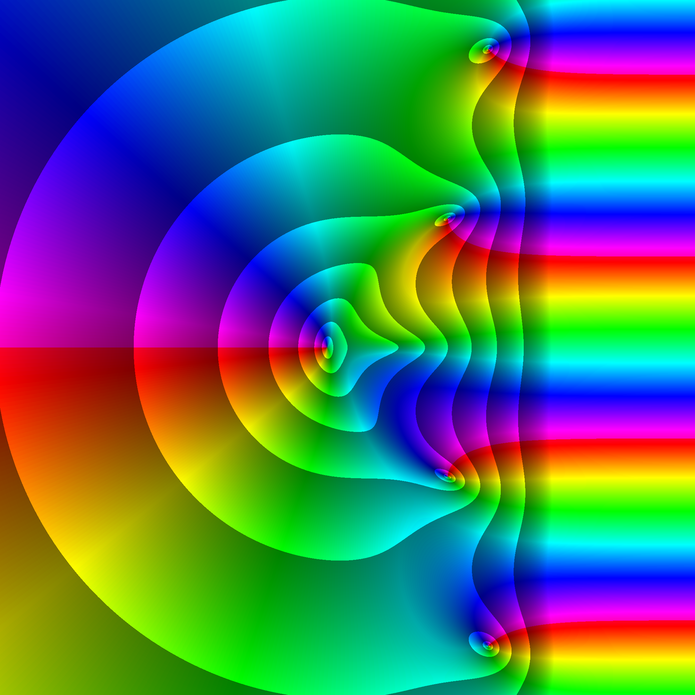
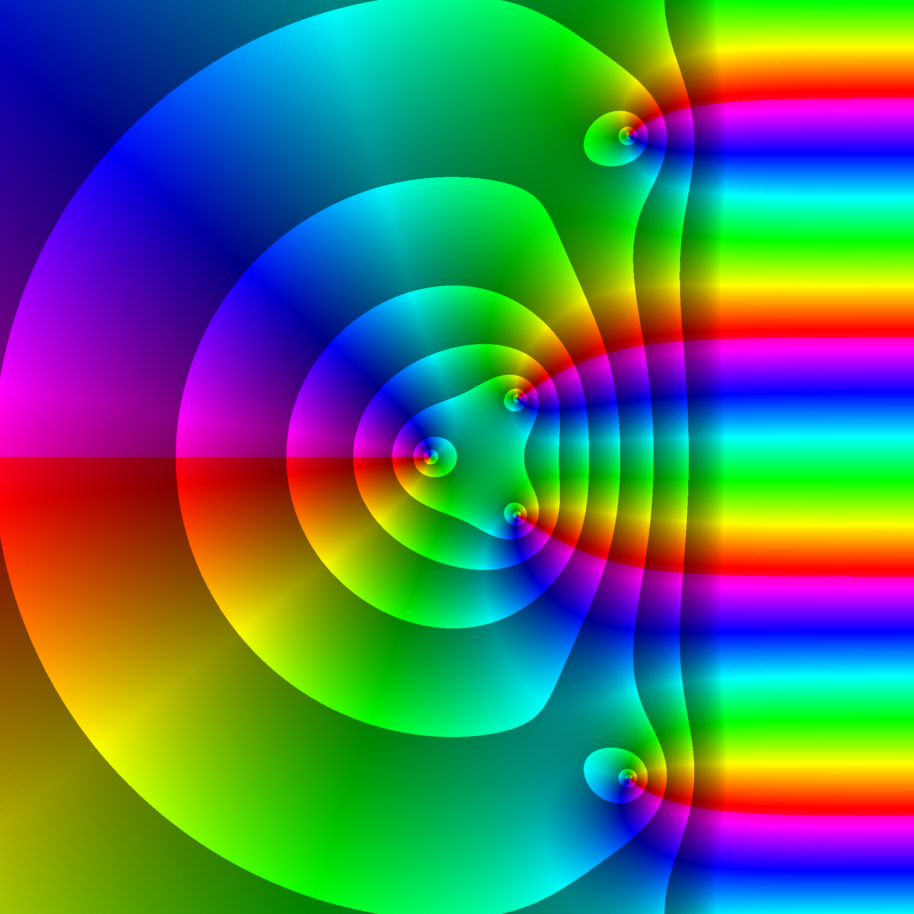

# Complex function plotter, written by Gondolindrim

This script takes a complex function f(z) and plots it using domain coloring and a few visual tricks.

In simple terms, the phase of f(z) is plotted as a hue change, while the magnitude is plotted in a brightness change.

This script was written specifcally to be used with LaTeX to generate pretty graphs of complex functions, so it was designed with that in mind.

The first trick is done by a discontinuous color on the brightness, showing magnitude steps with color brightness.
The levels of brightness are defined as logarithmic. This is because most functions will more often tend to infinity (see Liouville's Theorem). Meromorhpic functions tend to infinity at poles, and some functions of interest have essential singularities. Therefore it makes sense to plot orders of magnitude. If you want to give a customized array of levels this can also be done.

The script will show the plot and save it to an image "complex_data.png". If it already exists the script will overwrite; so if you like the picture be sure to save it before running the script again.

This script was based on the website https://samuelj.li/complex-function-plotter. For an interactive plotter, you are probably better off using this reference website rather than this script.

This script is licensed under the [Creative Commons Attribution 4.0 International  license](https://creativecommons.org/licenses/by/4.0/deed.en), whereby you can use this code even commercially but must credit it.

Some examples:

	f(z) = exp(conj(z)) - z^2

	f(z) = exp(z) - z^2

