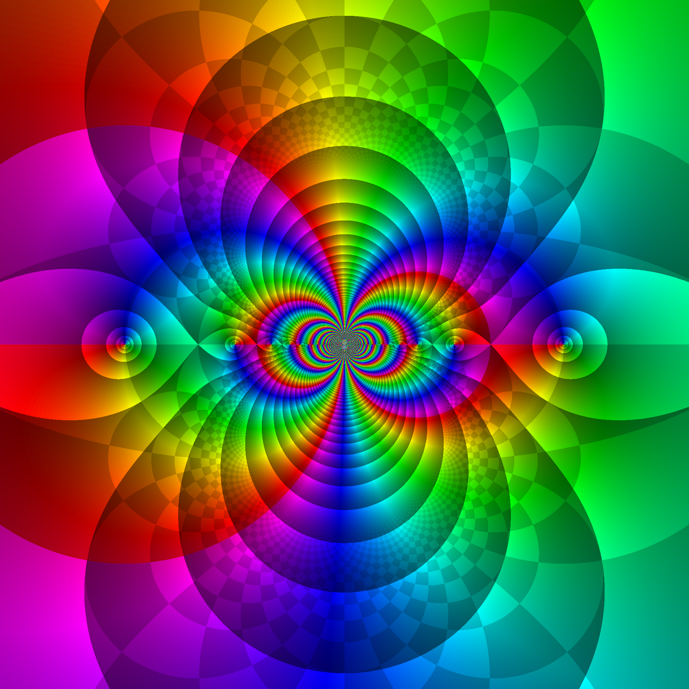

# Complex function plotter

This script takes a complex function f(z) and plots it using domain coloring and a few visual tricks. The script is written in Python, with the specific intent of using the complex functions of numpy and scipy and the graphical capabilities of matplotlib to to generate pretty graphs of complex functions for theses, dissertations, papers, and any other technical or academic document that can be written in LaTeX.

## How this script works

The first trick is done by a discontinuous color on the brightness, showing magnitude as color brightness with steps to denote changes in order of magnitude, so you can clearly see when the magnitude went from 10 to 100, or from e to e^2. And so on. There are functions in the code to generate logarithmic levels of brightness. This is because the (probably) most used functions will more often tend to infinity (see Liouville's Theorem). Meromorhpic functions tend to infinity at poles, and some functions of interest have essential singularities. Therefore it makes sense to plot orders of magnitude. If you want to give a customized array of levels this can also be done. If, however, you want to use specific levels, you can also supply those to the main function. You can have a single level by simply using the levels of minimum and maximum absolute value of the function in the particular region you are considering.

The second trick is plotting the argument of f(z) as a hue. The hue colors can be settable using Python's and matplotlib's colormaps; the script contains a function to export a particular colormap should it not be available on pgfplots, so the LaTeX colorbar can match the colorbar to the plot colormap.

These two "tricks" were based on the [website by Samuel Li](https://samuelj.li/complex-function-plotter) which source code can be found [here](https://github.com/wgxli/complex-function-plotter) and on the [Wikipedia page for Domain Coloring](https://en.wikipedia.org/wiki/Domain_coloring). The links were last accessed on april 22, 2026.

## Where to use this

This script should not be used as an interactive plotter. If you want that, you are probably better off using the website rather than this script: it will take at least a couple seconds and, given enough points in the mesh, hours (do not ask me how I know). While I did not use any source code from Samuel's repositoryool, it uses the GNUPLv3, so if Python or LaTeX are not your cup of coffee and you just want to look at pretty plots you are again better off using his website. As beforesaid I wrote this tool for a quite specific application of writing academic papers and theses, to focus on visualization of complex-variable functions. And yes, as you have already probably noticed I have the weirdest procrastinations that include numerical complex analysis and software development.

This repository, its code and assets are licensed under the [Creative Commons Attribution 4.0 International  license](https://creativecommons.org/licenses/by/4.0/deed.en), whereby you can use this code even commercially but must credit it.

There are a ton of options the script gives but I do not have time (or inclination) to write documentation, so read the code I guess. Or reach out. The options should be fairly self-explanatory.

## LaTeX integration

The script will show the plot and save it to an image "complex_data.png". If it already exists the script will overwrite; so if you like the picture you generated be sure to save it before running the script again. If you want to integrate this into LaTeX, you need to save that image file to import it into your document using pgfplots. The folder `latex_application` shows a minimal working example (MWE) of how to do that, with a LaTeX application of the plots generated using pgfplots and TikZ, which are quite powerful, so you can tune it to your liking. The MWE includes a colorbar for the phase hue, and a grid. To see the immediate results of that code, hop into the folder and type `make pdf`, which will use the bash script included to generate the final file for you in a `build` folder. Again, if you use snippets from that code please cite this repository.

# Regarding colormaps

The `generate_latex_colormap` function generates LaTeX-ready RGB points from the colormaps, in case they are not defined in pgfplots. The colormap used in Samuel's website is `hsv`; the problem with this particular colormap is that it is cyclic, that is, the border between -pi and pi is blurred because both ends are red in color. Particularly, I like  `gist_rainbow` because it still has the "rainbow" effect, but it is not cyclic, so that one can see the angle changes between -pi and pi.

Below is a table of the colormaps I could find that are defined in both matplotlib and pgfplots, so if you don't want the hassle of importing a customized colormap you should use these.

| Colormap	| Python		| pgfplots		| Description					|
|---------------|-----------------------|-----------------------|-----------------------------------------------|
| Viridis	| cmap='viridis'	| colormap/viridis	| Perceptually uniform				|
| Hot		| cmap='hot'		| colormap/hot		| Black to red to yellow to white		|
| Cool		| cmap='cool'		| colormap/cool		| Cyan to magenta transition			|
| Copper	| cmap='copper'		| colormap/copper	| Black to copper/light brown			|
| Bone		| cmap='bone'		| colormap/bone		| Gray with a hint of blue; similar to MATLAB	|
| HSV		| cmap='hsv'		| colormap/hsv		| Classic cyclic rainbow			|
| Jet		| cmap='jet'		| colormap/jet		| Classic non-uniform rainbow			|
| Gray		| cmap='gray'		| colormap/blackwhite	| Standard grayscale				|

If you want to use a customized colormap, use this function to generate a ready-to-use colormap definition for pgfplots. Specifically for the `gist_raibow`, this  repo contains a definition file "gist_rainbow_latexdef.tex" that you can just use in your tex file by adding `\input{gist_rainbow_latexdef.tex}` in your preamble. This is done in the LaTeX MWE.

To generate one such file for a particular colormap, edit the script to use the colormap and dump the output into a file, like in

	python complex_plot.py > mycolormap.tex

and then do `\input{mycolormap.tex}`.

## Some examples

	f(z) = exp(conj(z)) - z^2

	f(z) = exp(z) - z^2

	And my favourite trippy one f(z) = sin(1/z)

